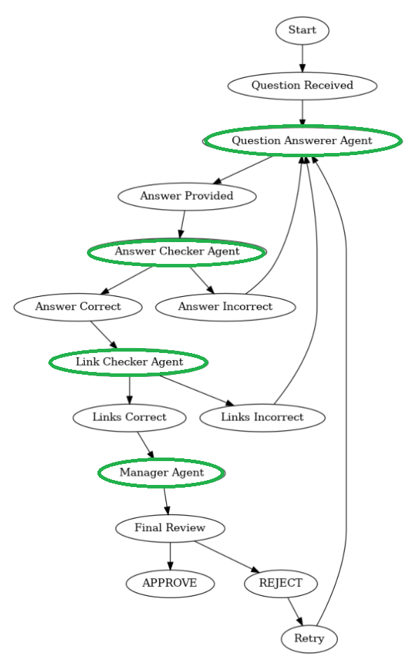

# RFX-Agents

A multi-agent system that helps with RFP/RFQ/RFI situations by providing accurate information about Microsoft technologies.



## Overview

RFX-Agents is a Streamlit application that implements a collaborative multi-agent system using Microsoft's Semantic Kernel framework. It helps answer questions about Microsoft technologies like Azure AI, Microsoft Fabric, Copilot Studio, and M365 Copilot by utilizing a team of specialized AI agents that work together to ensure accurate and validated information.

The idea came from the inspirational work of the QuestionnaireMultiagent repo from Marco Casalaina: https://github.com/mcasalaina/QuestionnaireMultiagent


## Features

- **Multiple Specialized Agents**: Four agents with distinct roles collaborate to deliver comprehensive and accurate answers:
  - 🔍 **QuestionAnswererAgent**: Searches for information and provides detailed answers
  - ✅ **AnswerCheckerAgent**: Verifies the accuracy of information provided
  - 🔗 **LinkCheckerAgent**: Validates URLs to ensure all references are working correctly
  - 📊 **ManagerAgent**: Coordinates workflow between agents and approves final responses

- **Web Search Integration**: Utilizes Bing Search API to find current and accurate information
- **Link Validation**: Automatically checks all URLs in answers to ensure they are valid and accessible, preventing hullucinations from LLM.
- **Research Context Selection**: Choose specific Microsoft technology contexts and limit search results to relevant Microsoft official documentation pages
- **Conversation History**: Maintains context for follow-up questions
- **Detailed Inner Monologue**: Option to view the collaborative thinking process between agents

## System Requirements

### Windows/Unix/Linux/macOS

- Python 3.8 or higher
- Git (for cloning the repository)
- Internet connection for API access
- Azure OpenAI API access 
  - Azure OpenAI API endpoint
  - Azure OpenAI API key
  - Azure OpenAI Chat deployment name (recommended: gpt-4.1 with 1M context length)
  - Azure OpenAI Chat Nano deployment name (e.g., gpt-4.1-nano with 1M context length)
- Bing Search API key

## Installation

### Windows

1. Clone the repository:
   ```
   git clone https://github.com/yourusername/RFX-Agents.git
   cd RFX-Agents
   ```

2. Create and activate a virtual environment:
   ```
   python -m venv venv
   venv\Scripts\activate
   ```

3. Install required packages:
   ```
   pip install -r requirements.txt
   ```

### Unix/Linux/macOS

1. Clone the repository:
   ```
   git clone https://github.com/yourusername/RFX-Agents.git
   cd RFX-Agents
   ```

2. Create and activate a virtual environment:
   ```
   python3 -m venv venv
   source venv/bin/activate
   ```

3. Install required packages:
   ```
   pip install -r requirements.txt
   ```

## Configuration

### Setting Up the Environment File

1. Copy the `.env.example` file to `.env` in the project root directory:

    ```bash
    cp .env.example .env
    ```

2. Editing the `.env` File

After copying the `.env` file, replace the placeholder values with your actual API credentials:

```plaintext
# Azure OpenAI API credentials
AZURE_OPENAI_ENDPOINT=https://your-azure-openai.openai.azure.com/
AZURE_OPENAI_API_KEY=your-azure-api-key
AZURE_OPENAI_CHAT_DEPLOYMENT_NAME=your-gpt-deployment-name
AZURE_OPENAI_CHAT_NANO_DEPLOYMENT_NAME=your-gpt-nano-deployment-name

# Bing Search API credentials
BING_SEARCH_API_KEY=your-bing-search-api-key
```

## Usage

1. Start the application:

   ```
   streamlit run rfx_multiagent_streamlit.py
   ```

2. A new page of your default browser is automatically opened for you. If not, navigate to the URL displayed in the terminal (usually http://localhost:8501)

3. In the sidebar:
   - Select the research contexts you want to focus on (Azure AI, Fabric, Copilot Studio, M365 Copilot), this will limit the search results to only come from the respective sub-level pages of official Microsoft Learn documentation pages. If nothing is selected, the search will be executed against whole internet.
   - Toggle the "Show Agents' Inner Monologue" option if you want to see the collaborative thinking process

4. Enter your question in the chat input at the bottom of the page and press Enter

5. The agents will collaborate to provide an accurate answer, with the following workflow:
   - QuestionAnswererAgent searches for information and provides an initial answer
   - AnswerCheckerAgent verifies the accuracy of the information
   - LinkCheckerAgent validates all URLs in the answer
   - ManagerAgent approves the final response once it passes all checks

The system uses Microsoft's Semantic Kernel framework to manage agent interactions and decision-making processes, with a conversation-aware approach that maintains context across multiple questions.

## Contributing

Contributions are welcome! Please feel free to submit a Pull Request.

## License

This project is licensed under the MIT License - see the LICENSE file for details.